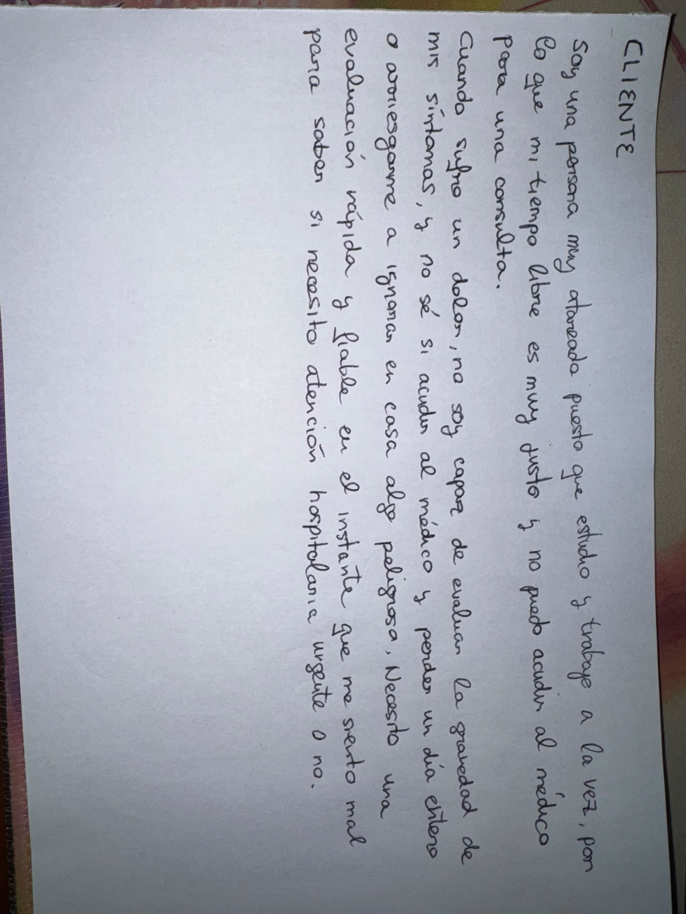

#PreSalud

Soy una persona muy atareada puesto que estudio y trabajo a la vez, por lo que mi tiempo libre es muy justo y no puedo acudir al médico para una consulta.   Cuando sufro un dolor, no soy capaz de evaluar la gravedad de mis síntomas, y no sé si acudir al médico y perder un día entero o arriesgarme a ignorar en casa algo peligroso. Necesito una evaluación rápida y fiable en el instante que me siento mal para saber si necesito atención hospitalaria urgente o no.

